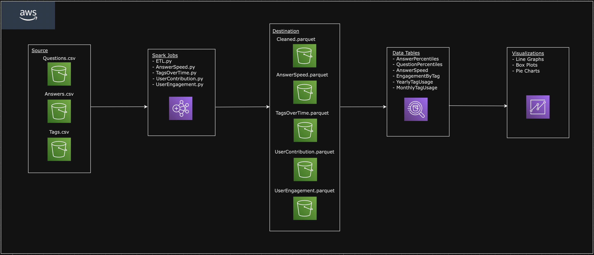
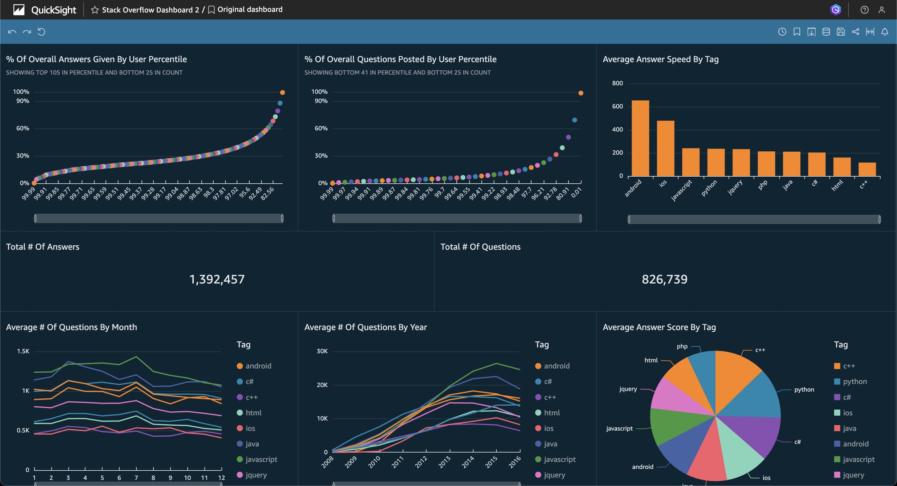

## Main Goal

The goal of this project is to perform an analysis of stack overflow data consisting of questions, answers, and tags. We will build a scalable data pipeline that runs in the cloud using Spark on EMR to process data which will be stored in three S3 buckets (answers, questions, tags). After transforming the data in Spark, we will store it in S3 in parquet format, and query directly from S3 using Athena. The end goal is to have a visualization in QuickSight of different insights related to user engagement, distinguished users, technology trends, and response speed.

## Data Pipeline

The starting point for our data pipeline is the three S3 buckets which contain the CSV files for questions, answers, and tags data. Our next step is to start up an EMR cluster and run five steps: one for each Spark script performing an analysis plus the ETL script. Each script writes the final data frames to parquet files which are then stored in destination S3 buckets. At this point, our data is ready to be queried by Athena. During this phase, we create tables that match the schemas of our data frames from each analysis and copy the data from our S3 buckets into these tables. After this is done, our data is ready to be accessed from QuickSight for visualization.

## Data Visualization

Once the processed data is put into the destination S3 bucket in parquet format, we will use Amazon Athena to directly and efficiently query the data from S3. Our analysis will consist of four major parts: Popularity of tags over time, relationship between question complexity and answer quality, speed of answers based on different tags, and user engagement (upvotes and number of answers per question). For the visualization tool we will use QuickSight which should easily connect to Athena.

## Technologies Used

- S3
- Spark on EMR
- Athena
- QuickSight
