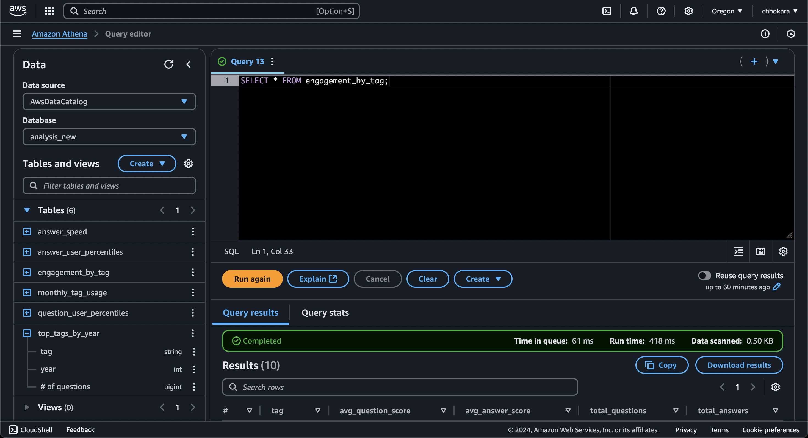

## Main Goal

The goal of this project is to perform an analysis of stack overflow data consisting of questions, answers, and tags. We will build a scalable data pipeline that runs in the cloud using Spark on EMR to process data which will be stored in three S3 buckets (answers, questions, tags). After transforming the data in Spark, we will store it in S3 in parquet format, and query directly from S3 using Athena. The end goal is to have a visualization in QuickSight of different insights related to user engagement, distinguished users, technology trends, and response speed.

## Technologies Used

- S3
- Spark
- EMR
- Athena
- QuickSight
- IAM
- Matplotlib
- Pandas
- Git

## Data Pipeline

The starting point for our data pipeline is the three S3 buckets which contain the CSV files for questions, answers, and tags data. Our next step is to start up an EMR cluster and run five steps: one for each Spark script performing an analysis plus the ETL script. Each script writes the final data frames to parquet files which are then stored in destination S3 buckets. At this point, our data is ready to be queried by Athena. During this phase, we create tables that match the schemas of our data frames from each analysis and copy the data from our S3 buckets into these tables. After this is done, our data is ready to be accessed from QuickSight for visualization.

## Data Visualization

Once the processed data is put into the destination S3 buckets in parquet format, we will use Amazon Athena to directly and efficiently query the data from S3. Our analysis will consist of four major parts: popularity of tags over time (yearly and monthly), analysis of power users (top Nth percentile), speed of answers based on different tags, and engagement of users (average question/answer score by tag). For the visualization tool we will use QuickSight which should easily connect to Athena.

## Running the project locally
Please start by downloading our dataset at the following link: https://drive.google.com/file/d/1VPRlAVGXJJA8UHRmzTW3iK1BP7d12-CL/view?usp=sharing
Once this is done, please unzip the file and place it in the root of the project directory. 

In order to run this project on your local machine, please ensure that you have the following dependencies installed:
  - pyspark
  - matplotlib
  - sparknlp

The following should help you run the ETL process along with the four analyses:
  - `spark-submit etl.py ./data/questions ./data/answers ./data/tags cleaned` (make sure you run this script first!)
  - `spark-submit answer_speed.py ./cleaned/questions ./cleaned/answers answer-speed`
  - `spark-submit user_engagement.py ./cleaned/questions ./cleaned/answers user-engagement`
  - `spark-submit tags_over_time.py ./cleaned/questions tags-over-time`
  - `spark-submit user_contribution.py ./cleaned/questions ./cleaned/answers user-contribution`

In order to view our regression plots for the monthly/yearly usage analysis, please do the following:
  - `python3 plot_monthly_usage.py`
  - `python3 plot_yearly_usage.py`

In order to run our NLP process, please do the following:
  - `python3 nlp.py cleaned/nlp [name of directory to save tag prediction model]` 

## Inspecting our Data in Athena
Using the credentials I setup with your help in the labs, you can also run basic `SELECT` queries in the Athena Query Editor to see what our data looks like for each analysis. Please follow the following steps:

  - Open the AWS services tab in the top left
  - Go to Athena main page
  - In Athena make sure the 'editor' tab is selected
  - In the query editor run the following 6 queries to inspect each of the 6 tables we produced:
  - `SELECT * FROM answer_speed`
  - `SELECT * FROM answer_user_percentiles`
  - `SELECT * FROM question_user_percentiles`
  - `SELECT * FROM monthly_tag_usage`
  - `SELECT * FROM top_tags_by_year`
  - `SELECT * FROM engagement_by_tag`
  - After running one of these queries you will see something like this:

  - On the left hand side you can click on the "plus" sign beside each table to see the schema of the associated table
  - Next to the tables is the query editor where you will enter the `SELECT` query
  - Below the query editor is the region where you will see the results of running that query
