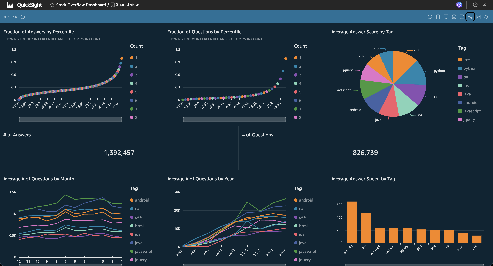
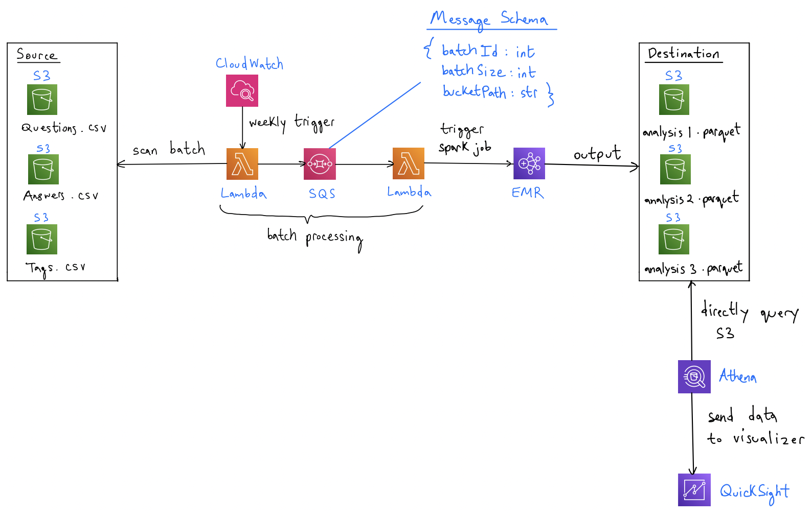

# Purpose

## Goal

The goal of this project is to perform an analysis of stack overflow data consisting of questions, answers, and tags. We will build a scalable data pipeline that runs in the cloud using Spark on EMR to process data which will be stored in three S3 buckets (answers, questions, tags). After transforming the data in Spark, we will store it in S3 in parquet format, and query directly from S3 using Athena. The end goal is to have a visualization in QuickSight of different insights related to user engagement, popularity, trends, and quality of answers.

## Data Processing

Rather than processing the entirety of this large dataset in Spark in one go, we will follow a batch-oriented procedure using Lambda and SQS. The idea is to split the data into batches based on the timestamp (16 years of data so roughly 16 batches). Our Lambda function will scan the S3 buckets to identify the batches and then send a message to SQS including metadata (S3 filepath, year, row numbers, etc.) to tell SQS which part of the CSV file belongs to the batch. We will then have a trigger which tells our EMR cluster to process the batch (cleaning, transforming, converting to parquet file) and store it in an S3 destination bucket.

## Data Visualization

Once the processed data is put into the destination S3 bucket in parquet format, we will use Amazon Athena to directly and efficiently query the data from S3. Our analysis will consist of four major parts: Popularity of tags over time, relationship between question complexity and answer quality, speed of answers based on different tags, and user engagement (upvotes and number of answers per question). For the visualization tool we will use QuickSight which should easily connect to Athena.

# Technologies

- S3
- Lambda
- SQS
- Spark on EMR
- Athena
- QuickSight

# Design

