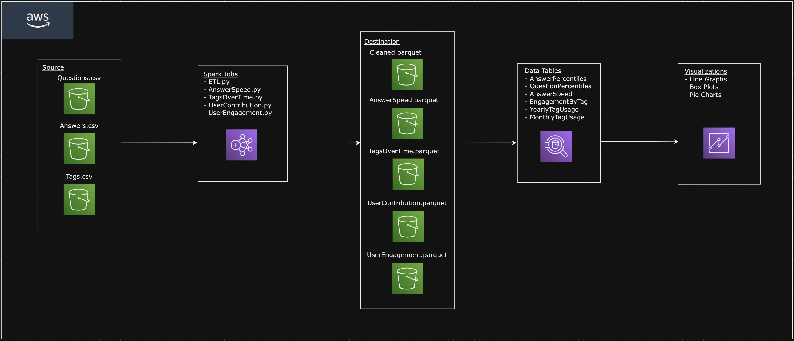
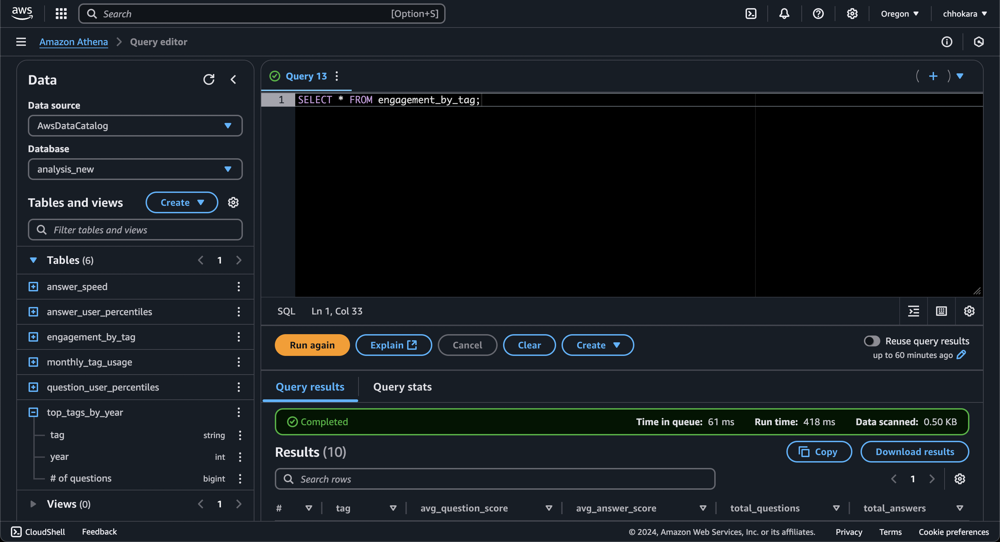
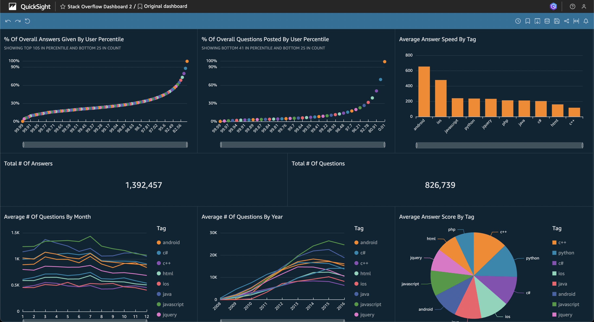

# Stack Overflow NLP & Data Analysis Pipeline

A scalable big data pipeline for analyzing Stack Overflow questions, answers, and tags using Apache Spark on AWS EMR. This project processes large-scale data to generate insights on user engagement, technology trends, answer response times, and power user contributions.

## Table of Contents

- [Overview](#overview)
- [Architecture](#architecture)
- [Technologies Used](#technologies-used)
- [Project Structure](#project-structure)
- [Analysis Components](#analysis-components)
- [Installation](#installation)
- [Usage](#usage)
  - [Running Locally](#running-locally)
  - [Running on AWS EMR](#running-on-aws-emr)
- [Data Schema](#data-schema)
- [Querying Results with Athena](#querying-results-with-athena)
- [Dashboard](#dashboard)

## Overview

This project performs comprehensive analysis of Stack Overflow data to uncover insights about:

- **Technology Trends**: Track the popularity of programming languages and frameworks over time (yearly and monthly)
- **Answer Speed**: Analyze how quickly quality answers are provided for different technology tags
- **User Engagement**: Measure average question/answer scores and activity levels by technology
- **Power Users**: Identify top contributors and analyze the distribution of user contributions
- **Tag Prediction**: Use NLP to predict appropriate tags for questions based on content

The pipeline processes raw CSV data through an ETL phase, runs four parallel analysis scripts, and outputs results in Parquet format for querying with Amazon Athena and visualization in QuickSight.

## Architecture



**Pipeline Flow:**

```
Raw Data (S3/Local CSV)
         |
         v
    +---------+
    | ETL.py  |  Cleans, filters, joins data
    +---------+
         |
         v
  Cleaned Parquet Files
         |
    +----+----+----+----+
    |    |    |    |    |
    v    v    v    v    v
  [Analysis Scripts Run in Parallel]
    |    |    |    |    |
    v    v    v    v    v
  Output Parquet Files (S3)
         |
         v
    +---------+
    | Athena  |  SQL Tables
    +---------+
         |
         v
   +------------+
   | QuickSight |  Visualizations
   +------------+
```

## Technologies Used

| Category | Technologies |
|----------|-------------|
| **Big Data Processing** | Apache Spark (PySpark) |
| **Cloud Infrastructure** | AWS EMR, AWS S3, AWS IAM |
| **Query Engine** | AWS Athena |
| **Visualization** | AWS QuickSight, Matplotlib |
| **Machine Learning** | Spark NLP, Spark ML Pipeline |
| **Data Manipulation** | Pandas |
| **Data Format** | CSV (input), Parquet (output) |
| **Version Control** | Git |

## Project Structure

```
CMPT-732-Project/
├── etl.py                    # Data cleaning and transformation pipeline
├── answer_speed.py           # Answer response time analysis
├── user_engagement.py        # User activity and engagement metrics
├── tags_over_time.py         # Tag popularity trends (yearly/monthly)
├── user_contribution.py      # Power user percentile analysis
├── nlp.py                    # NLP model for tag prediction
├── plot_monthly_usage.py     # Monthly trend regression plots
├── plot_yearly_usage.py      # Yearly trend regression plots
├── assets/                   # Documentation images
│   ├── design.png           # Architecture diagram
│   ├── dashboard.png        # QuickSight dashboard screenshot
│   └── athena.png           # Athena query interface
├── Final Project Report.pdf  # Detailed project report
└── README.md                 # This file
```

## Analysis Components

### 1. ETL Pipeline (`etl.py`)

The ETL script prepares raw data for analysis:
- Reads raw CSV files (questions, answers, tags)
- Identifies and filters to the **top 10 most popular tags**
- Joins questions with their associated tags
- Validates data integrity (removes answers posted before questions)
- Repartitions data by tag for efficient downstream processing
- Outputs cleaned Parquet files

### 2. Answer Speed Analysis (`answer_speed.py`)

Analyzes how quickly quality answers (score > 2) are provided:
- Calculates time delta between question creation and first quality answer
- Aggregates average answer speed per technology tag
- **Output**: `answer_speed` table

### 3. User Engagement Analysis (`user_engagement.py`)

Measures user activity and content quality by tag:
- Average question score per tag
- Average answer score per tag
- Total question and answer counts per tag
- **Output**: `engagement_by_tag` table

### 4. Tags Over Time Analysis (`tags_over_time.py`)

Tracks technology popularity trends:
- Yearly tag usage counts and rankings
- Monthly tag usage breakdown
- Enables trend analysis and forecasting
- **Output**: `top_tags_by_year` and `monthly_tag_usage` tables

### 5. User Contribution Analysis (`user_contribution.py`)

Identifies power users through percentile analysis:
- Calculates contribution percentiles for question askers
- Calculates contribution percentiles for answer providers
- Maps user percentiles to their fraction of total contributions
- **Output**: `question_user_percentiles` and `answer_user_percentiles` tables

### 6. NLP Tag Prediction (`nlp.py`)

Machine learning model for automatic tag suggestion:
- Uses Universal Sentence Encoder embeddings
- MultiClassifierDL for multilabel classification
- Trained on question titles and bodies
- Predicts appropriate tags for new questions

### 7. Visualization Scripts

- **`plot_monthly_usage.py`**: Generates regression plots for monthly tag trends
- **`plot_yearly_usage.py`**: Generates regression plots for yearly tag trends

## Installation

### Prerequisites

- Python 3.5+
- Apache Spark 3.0+
- Java 8 or 11 (required for Spark)

### Dependencies

Install the required Python packages:

```bash
pip install pyspark pandas matplotlib spark-nlp
```

### Dataset

Download the Stack Overflow dataset:

1. Download from: [Google Drive Link](https://drive.google.com/file/d/1VPRlAVGXJJA8UHRmzTW3iK1BP7d12-CL/view?usp=sharing)
2. Unzip the file
3. Place the `data` folder in the project root directory

The data folder should contain:
```
data/
├── questions/    # Question CSV files
├── answers/      # Answer CSV files
└── tags/         # Tag CSV files
```

## Usage

### Running Locally

**Step 1: Run the ETL Pipeline (required first)**

```bash
spark-submit etl.py ./data/questions ./data/answers ./data/tags cleaned
```

**Step 2: Run Analysis Scripts**

These can be run in any order after ETL completes:

```bash
# Answer speed analysis
spark-submit answer_speed.py ./cleaned/questions ./cleaned/answers answer-speed

# User engagement analysis
spark-submit user_engagement.py ./cleaned/questions ./cleaned/answers user-engagement

# Tag trends analysis
spark-submit tags_over_time.py ./cleaned/questions tags-over-time

# Power user analysis
spark-submit user_contribution.py ./cleaned/questions ./cleaned/answers user-contribution
```

**Step 3: Generate Visualizations**

```bash
# Monthly usage trends with regression
spark-submit plot_monthly_usage.py ./tags-over-time

# Yearly usage trends with regression
spark-submit plot_yearly_usage.py ./tags-over-time
```

**Step 4: Train NLP Model (Optional)**

```bash
python3 nlp.py ./cleaned/nlp tag_prediction_model
```

### Running on AWS EMR

1. Upload raw data to S3 buckets:
   - `s3://your-bucket/questions/`
   - `s3://your-bucket/answers/`
   - `s3://your-bucket/tags/`

2. Create an EMR cluster with Spark

3. Add steps for each script, replacing local paths with S3 paths:
   ```bash
   spark-submit etl.py s3://input-bucket/questions s3://input-bucket/answers s3://input-bucket/tags s3://output-bucket/cleaned
   ```

4. Results will be written to your output S3 bucket in Parquet format

## Data Schema

### Input Data

**Questions CSV:**
| Column | Type | Description |
|--------|------|-------------|
| Id | Integer | Unique question identifier |
| OwnerUserId | Integer | User who posted the question |
| CreationDate | Timestamp | When the question was posted |
| ClosedDate | Timestamp | When the question was closed (if applicable) |
| Score | Integer | Net upvotes/downvotes |
| Title | String | Question title |
| Body | String | Question content |

**Answers CSV:**
| Column | Type | Description |
|--------|------|-------------|
| Id | Integer | Unique answer identifier |
| OwnerUserId | Integer | User who posted the answer |
| CreationDate | Timestamp | When the answer was posted |
| ParentId | Integer | Question ID this answers |
| Score | Integer | Net upvotes/downvotes |
| Body | String | Answer content |

**Tags CSV:**
| Column | Type | Description |
|--------|------|-------------|
| Id | Integer | Question ID |
| Tag | String | Tag name |

### Output Tables

| Table | Description |
|-------|-------------|
| `answer_speed` | Average time to first quality answer by tag |
| `engagement_by_tag` | Engagement metrics (scores, counts) by tag |
| `top_tags_by_year` | Yearly tag usage statistics |
| `monthly_tag_usage` | Monthly tag usage breakdown |
| `question_user_percentiles` | Question contribution distribution |
| `answer_user_percentiles` | Answer contribution distribution |

## Querying Results with Athena

After running the pipeline on AWS, you can query results using Athena:

1. Open AWS Athena console
2. Navigate to the Query Editor
3. Run queries to inspect the data:

```sql
SELECT * FROM answer_speed;
SELECT * FROM engagement_by_tag;
SELECT * FROM top_tags_by_year;
SELECT * FROM monthly_tag_usage;
SELECT * FROM question_user_percentiles;
SELECT * FROM answer_user_percentiles;
```



## Dashboard

The final visualizations are available in AWS QuickSight, providing interactive exploration of:
- Technology trend lines over time
- Answer speed comparisons across technologies
- User engagement heatmaps
- Power user contribution charts



**Live Dashboard**: [View on QuickSight](https://us-west-2.quicksight.aws.amazon.com/sn/dashboards/6a24e2bf-2fcd-4183-833f-9acdf2326174/views/65a2e0a1-d0d4-4c6f-93dd-6d3e4062b22a?directory_alias=chhokara)

---

*This project was developed for CMPT-732 (Big Data Laboratory) at Simon Fraser University.*
